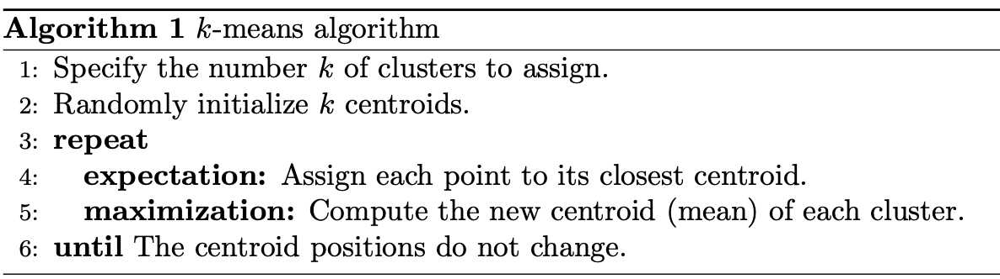

# K-means

It can be used for quantization.
But can be not sensitive to little details. Cause reconfiguration of every cluster in every epoch is with mean method. Even with many clusters. Random initialisation.. And need to be known num of clusters.

Examples

<p align="center"> 
   
</p>

<p align="center"> </p>

# MeanShift

Mean shift clustering using a flat kernel.
Mean shift clustering aims to discover “blobs” in a smooth density of samples. It is a centroid-based algorithm, which works by updating candidates for centroids to be the mean of the points within a given region. These candidates are then filtered in a post-processing stage to eliminate near-duplicates to form the final set of centroids.

<p align="center"> </p>

It has a complexity O(T*n^2). Cause it makes a bad joke for computer vision task.


# DBSCAN 

Density-Based Spatial Clustering of Applications with Noise. Finds core samples of high density and expands clusters from them. Good for data which contains clusters of similar density.
But not good for image like this cat.

# Simple Linear Iterative Clustering (SLIC) or Superpixels

This works simmilar to K-meants but with limited xy regions.  O(N)

<p align="center"> </p>
<p align="center"> </p>

https://core.ac.uk/download/pdf/147983593.pdf

# More

Many of algorithms can be found in sklearn https://scikit-learn.org/stable/modules/clustering.html

# Clustering aproaches links

```
https://www.hindawi.com/journals/mpe/2016/3180357/
```
