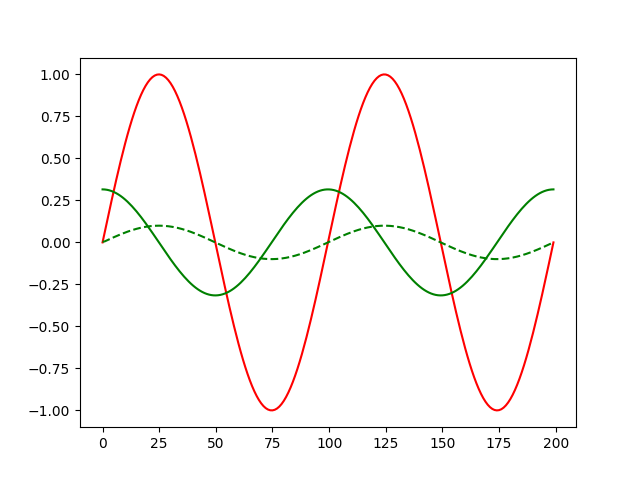
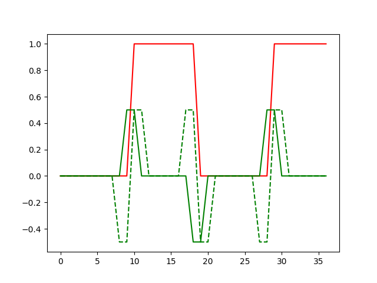
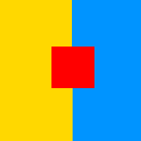
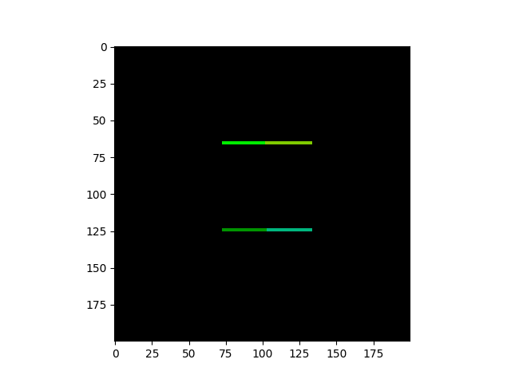
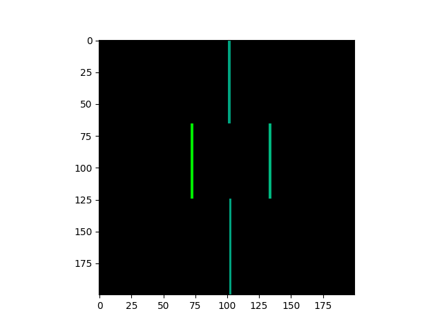
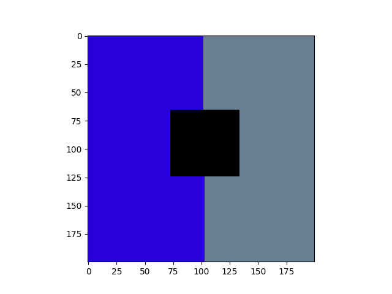

# Gradients


	In some types of calculations we need make and gradient. To make it is possible with many of instruments. As example gradient of sin and rectangle signal, where the signal is red and first and second gradients green.

<p align="center"> 

</p>
<p align="center"> 

</p>


Example for 3d gradient (widht,height,channel) of an simple image

<p align="center"> 

</p>

<p align="center"> 



</p>

# Laplacian 

	Laplacian is and differencial operator, can be used to find derivative. But laplacian wawelets can be used to find solution for many differencial equations.
like rourier transform and is сlosely related to the Laplace transform. And for standart kernel the result will be like on images higher.
```https://ocw.mit.edu/courses/mathematics/18-156-differential-analysis-ii-partial-differential-equations-and-fourier-analysis-spring-2016/```
```https://www.researchgate.net/publication/316869945_Laplace_wavelet_transform_theory_and_applications``` 


