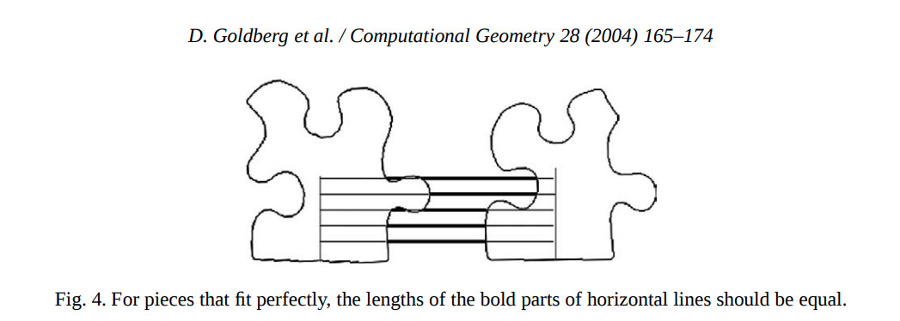

# Puzzle solver approaches

1) "A global approach to automatic solution of jigsaw puzzles."  David Goldberg, Christopher Malon, Marshall Bern
<p align="center"> </p>

2) "Automatic Solution of Jigsaw Puzzles" Daniel J. Hoff

3) "A metaheuristic approach for solving jigsaw puzzles" Hamzeh Ghasemzadeh
```
There are two different types of problem in solving
jigsaw puzzles. One of them is a pattern recognition
problem. The other one is a combinatorial problem. Most of
previous works have elaborated just on the first problem,
but the second problem has not been investigated properly.
This paper specifically aimed at this problem. 
```


Some solver links
```
https://github.com/Kawaboongawa/Zolver
https://github.com/jean-malo/jigsaw-solver
```

