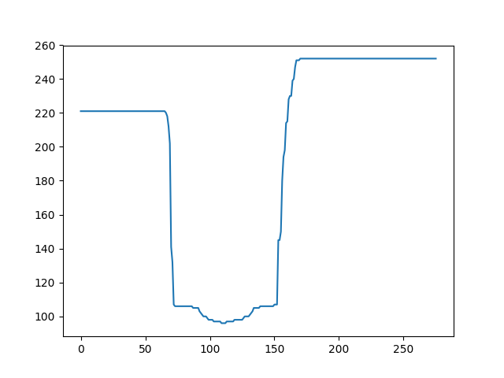

# Signal filtering

1) FFT high frequency filter

 

 

2) SMA high frequency filter

 

3) Sinc filter with window size 20 and 80

 

4) Median filter

  

some links
https://docs.scipy.org/doc/scipy/reference/generated/scipy.ndimage.median_filter.html
https://ru.wikipedia.org/wiki/%D0%9A%D0%B0%D1%82%D0%B5%D0%B3%D0%BE%D1%80%D0%B8%D1%8F:%D0%A4%D0%B8%D0%BB%D1%8C%D1%82%D1%80%D0%B0%D1%86%D0%B8%D1%8F
