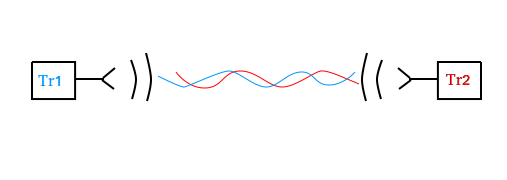
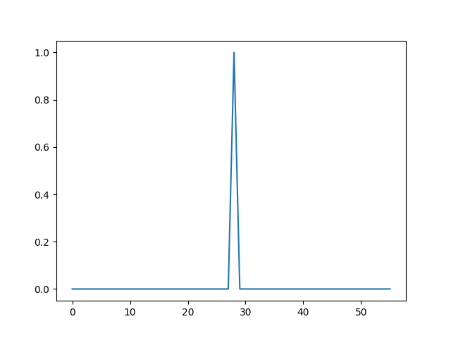
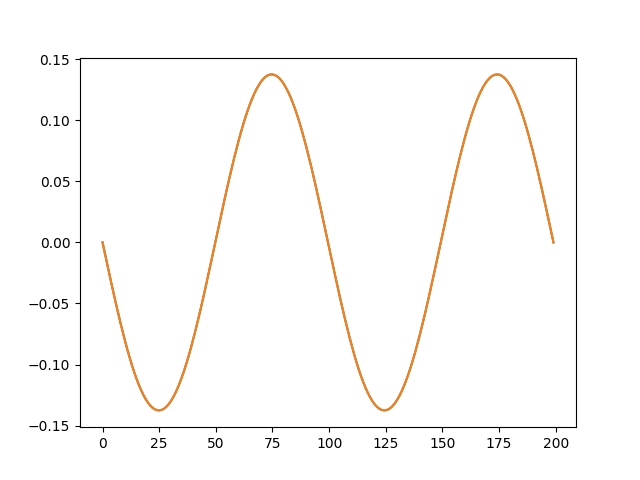
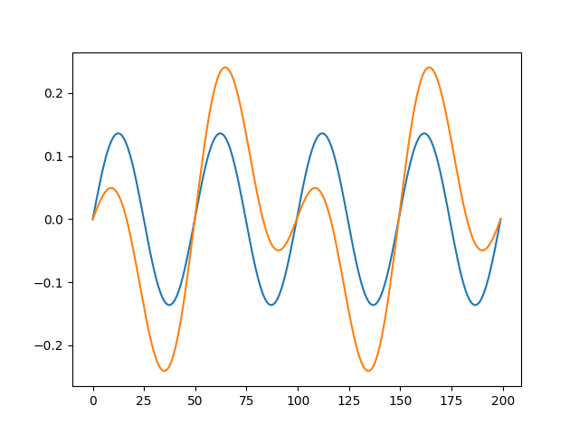
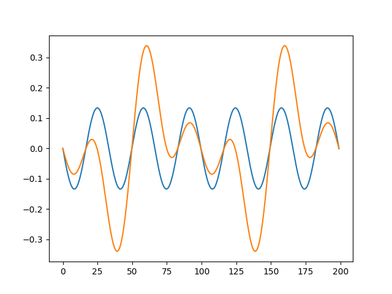
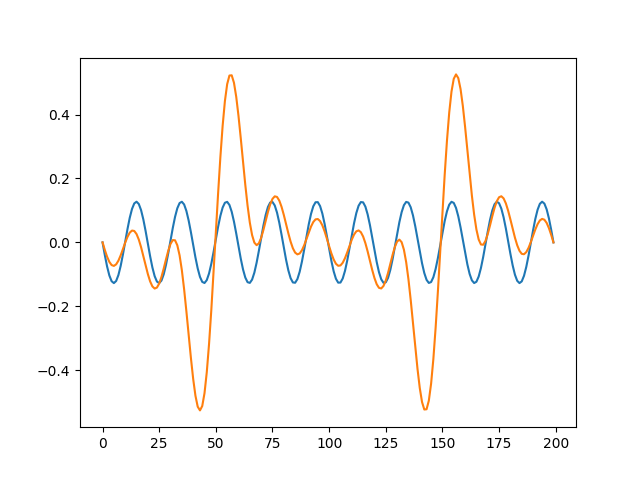

### standing wave


If we have transceiver 1 and transceiver 2 and we wanna to make an area of ​​space with high voltage

<p align="center"> </p>
<p align="center"> </p>

There the result of 2 transceivers will be

```
res = signal1 - signal2
```

But what if we wanna to have some difficult than sin wave? Like local peak staning area

<p align="center"> </p>

Then we need an wave with lenght of space that we need as first harmonic
<p align="center"> </p>
As example for local peak for 10cm lenght 

```
60  	MHz signal f1 to become 2.5  		cm hight voltage area
120  	MHz signal f1 to become 1.25  		cm hight voltage area
240  	MHz signal f1 to become 0.625  		cm hight voltage area
480  	MHz signal f1 to become 0.3125  	cm hight voltage area
960  	MHz signal f1 to become 0.15625  	cm hight voltage area
1920  	MHz signal f1 to become 0.078125  	cm hight voltage area
3840  	MHz signal f1 to become 0.0390625  	cm hight voltage area
7680  	MHz signal f1 to become 0.01953125  	cm hight voltage area
15360  	MHz signal f1 to become 0.009765625  	cm hight voltage area
30720  	MHz signal f1 to become 0.0048828125  	cm hight voltage area
```

<p align="center"> </p>
<p align="center"> </p>
<p align="center"> </p>
