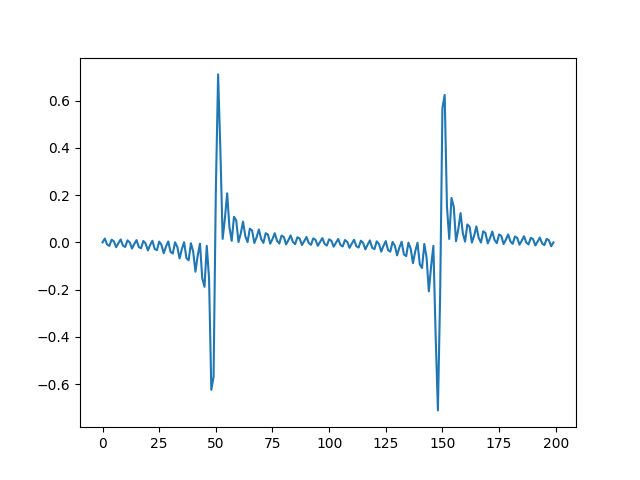

### standing wave


If we have transceiver 1 and transceiver 2 and we wanna to make an area of ​​space with high voltage

<p align="center"> </p>
<p align="center"> </p>

There the result of 2 transceivers will be

```
res = signal1 - signal2
```

But what if we wanna to have some difficult than sin wave? Like local peak staning area

<p align="center"> </p>

Then we need an wave with lenght of space that we need as first harmonic
<p align="center"> </p>
As example for local peak for 10cm lenght 

```
6000  	MHz signal f2 to become 2.5  		cm hight voltage area
12000  	MHz signal f3 to become 1.25  		cm hight voltage area
24000  	MHz signal f4 to become 0.625  		cm hight voltage area
48000  	MHz signal f5 to become 0.3125  	cm hight voltage area
96000  	MHz signal f6 to become 0.15625  	cm hight voltage area
192000  	MHz signal f7 to become 0.078125  	cm hight voltage area
384000  	MHz signal f8 to become 0.0390625  	cm hight voltage area
768000  	MHz signal f9 to become 0.01953125  	cm hight voltage area
1536000  	MHz signal f10 to become 0.009765625  	cm hight voltage area
3072000  	MHz signal f11 to become 0.0048828125  	cm hight voltage area
```

<p align="center"> </p>
<p align="center"> </p>
<p align="center"> </p>
To become resalt like last image
<p align="center"> </p>
